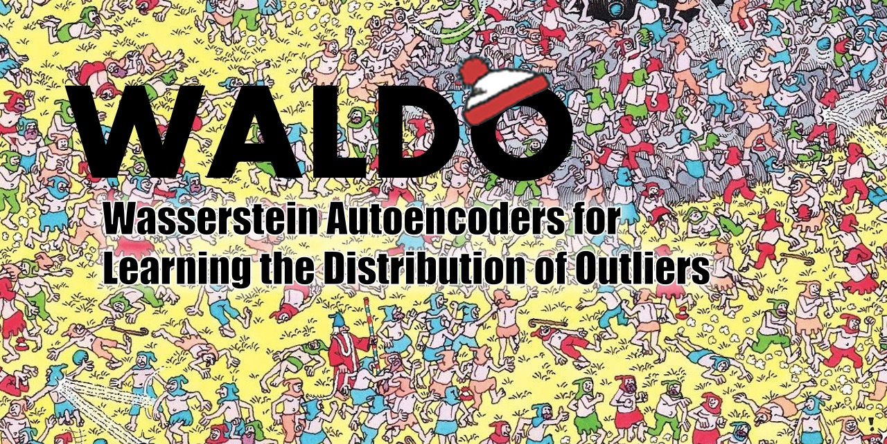
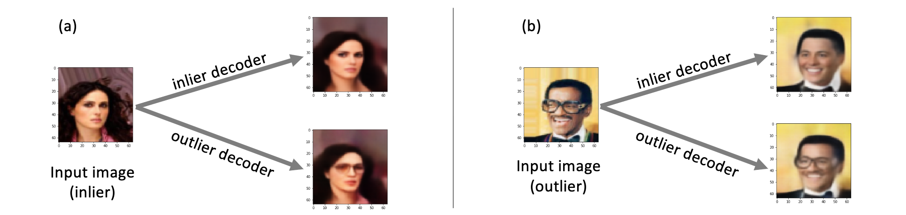

WALDO: Wasserstein Autoencoders for Learning the Distribution of Outliers

__Abstract__ :A new framework for outlier detection and generation is introduced by lifting data into the space of probability distributions which are not analytically expressible but from which samples can be drawn using a neural generator. Given a mixture of unknown latent in- lier and outlier distributions, a Wasserstein double autoencoder is used to both detect and generate inliers and outliers. The proposed method, named WALDO (Wasserstein Autoencoder for Learning the Distribution of Outliers), is evaluated on classical data sets including MNIST, CIFAR10 and KDD99 to evaluate its detection accuracy. As an application of outlier generation, we demonstrate how our approach can be used to generate realistic intrusion at- tacks that can be used for simulation exercises to protect network infrastructure. However we foresee many application scenarios where WALDO can be used. To the best of our knowledge this is the first work that studies both outlier detection and generation together.

